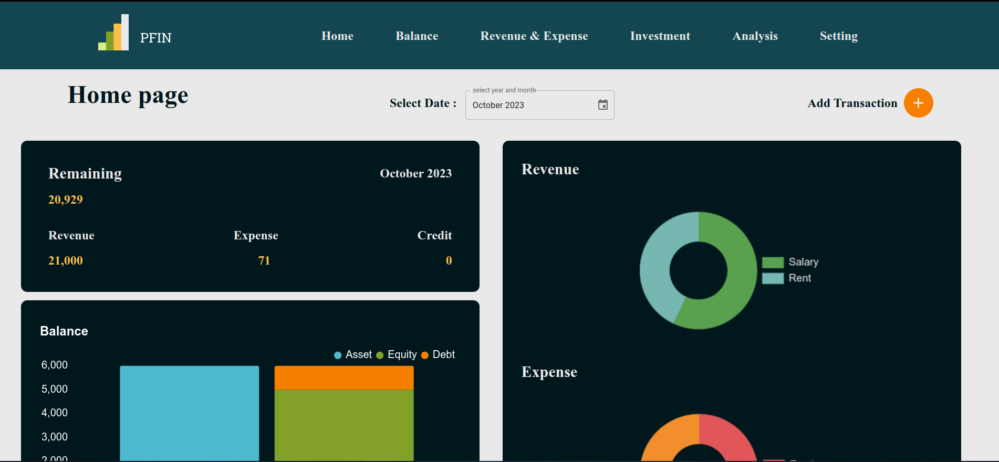

# PFin-personal-finance

<p align="center" width="100%">
     
    <p align="center">PFin</p>
</p>

PFin is a personal-finance website created for user to track personal financial status include Revenue, Expense, Asset, Debt and etc. PFin allows user to add their financial record and view their financial status in a dashboard. 
This project is developed by using [Next.js](https://nextjs.org/docs) as a frontend framework. PFin API server is built by using [Fiber](https://docs.gofiber.io/) as a backend framework. PFin is using [PostgreSQL](https://www.postgresql.org/docs/) as a database. Note that this project is just for learning purpose.


## Table of Contents

- [Installation](#Installation)
- [Run the app](#run-the-app)
- [Pages](#Pages)
- [Feature](#Feature)


## Installation
```
    git clone https://github.com/Nas-virat/PFin-personal-finance
```

## Run the app

### Run the API server
```
    cd server
    go run main.go // run the server
```
### Run the frontend server
```
    cd client
    npm run dev
```

## Pages

- Home page

In The home page, user can see the summary of their financial status. It show the total amount of revenue, expense, asset and debt. User can also see source of revenue and expense represented by pie chart.

<p align="center" width="100%">
    
</p>

